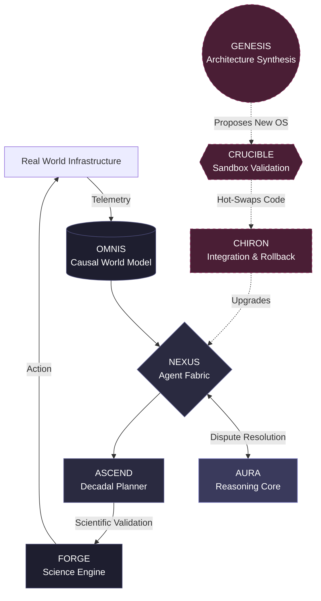

# Artificial Civilization Intelligence (ACI) Framework

**Proposed by Team Auralis**

## Overview
Artificial Civilization Intelligence (ACI) is a proposed class of intelligent system architecture designed to maintain a persistent model of civilization and its environment, coordinate heterogeneous intelligent agents and humans, reason across interconnected domains, conduct scientific and technological discovery, plan over long horizons, interact with real-world infrastructure, learn from outcomes, and operate under explicit governance and authority constraints.

This repository contains the foundational architectural definitions, whitepapers, and the **ACI-001 Benchmark** for evaluating such systems.

### 💻 Reference Implementation
Looking for code? The official reference implementation and executable MVP for the ACI architecture is located in the [**ORION Repository**](https://github.com/Team-Auralis/orion). 

## Beyond ASI
For decades, the AI industry has pursued Artificial Superintelligence (ASI)—a monolithic, hyper-intelligent oracle. We propose that this is a structural fallacy. **Intelligence without infrastructure, continuity, and coordination is just computation.** 

ACI is the necessary paradigm shift. It proposes that the ultimate evolution of machine intelligence is not a singular mind, but a **distributed, antifragile, institutional intelligence** that functions as a civilization itself. 

Read our foundational manifesto: [Beyond ASI: The ACI Paradigm](docs/BEYOND_ASI_THE_ACI_PARADIGM.md).

## Core Documentation Index
- [The ACI Paradigm (Beyond ASI)](docs/BEYOND_ASI_THE_ACI_PARADIGM.md)
- [Master Guide: From ACI to OCI](docs/ACI_VS_OCI_MASTER_GUIDE.md)
- [ACI Definition](docs/ACI_DEFINITION.md)
- [Origin and Provenance](docs/ACI_ORIGIN_AND_PROVENANCE.md)
- [ACI vs AGI vs ASI](docs/ACI_VS_AGI_VS_ASI.md)
- [System Architecture](docs/architecture/ACI_SYSTEM_ARCHITECTURE.md)
- [ACI-001 Benchmark](docs/research/ACI_001_BENCHMARK.md)

Explore the `docs/architecture/` directory for deep-dives into the **AURA**, **OMNIS**, **NEXUS**, **FORGE**, and **ASCEND** subsystems.

## License & Legal Disclaimer
Copyright (c) 2026 Team Auralis.
All architectural concepts and documentation published here are intended for public research, discourse, and reference.

**Important Legal Notice:** The term "Artificial Civilization Intelligence" (ACI) was originally coined by Raja Dharma Tej Maddala (Raja MagRex AI™). Team Auralis is an entirely independent research group. The architectures (ORION, OMNIS, NEXUS, etc.) in this repository are 100% independent, open-source engineering implementations. For full details on historical attribution and IP boundaries, please read our [Origin and Provenance](docs/ACI_ORIGIN_AND_PROVENANCE.md) document.
