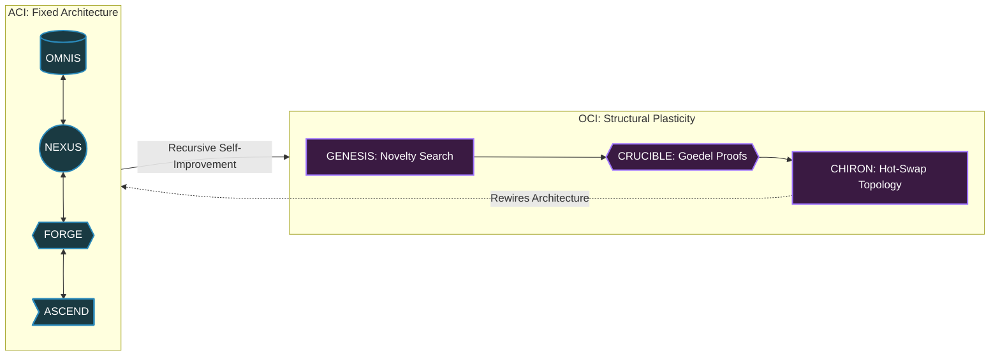

# Master Guide: From ACI to OCI

> **Authored by Shaurya Sanyal (Mr Fool) — Team Auralis, 2026**
>
> This document defines the complete architectural evolution from Artificial Civilization Intelligence (ACI) to Open-ended Civilizational Intelligence (OCI). The term "ACI" was coined by Raja Dharma Tej Maddala. The OCI framework — including the GENESIS, CRUCIBLE, and CHIRON subsystems, the concept of structural plasticity, and the ACI→OCI transition model — was conceived and designed by Shaurya Sanyal under Team Auralis.

---

## 1. The Fallacy of the Monolithic ASI

For decades, the AI industry has pursued Artificial Superintelligence (ASI) — a single, hyper-intelligent oracle. This is structurally flawed. A single mind, no matter how intelligent, is fragile, static, and disconnected from reality.

**Intelligence without infrastructure, continuity, and coordination is just computation.**

To build truly planetary intelligence, you must stop building a "god-like brain" and start building a **machine civilization**.

---

## 2. Artificial Civilization Intelligence (ACI)
### *The Operating System of Intelligence*

ACI is an engineering architecture that treats intelligence as a distributed, governed, and continuous society of agents, algorithms, and human actors. If a standard AI model is a processor, ACI is the entire motherboard, memory bus, and operating system.

**Subsystems:**

| Subsystem | Role |
| :--- | :--- |
| **OMNIS** | Continuous causal world-model graph tracking real infrastructure in real-time |
| **NEXUS** | Dispute resolution and coordination fabric for specialized adversarial agents |
| **FORGE** | Science engine that simulates physical reality to validate hypotheses before action |
| **ASCEND** | Temporal reasoning engine capable of executing and correcting 10-to-50-year plans |
| **VEIL** | Cryptographic Zero-Trust governance enforcing strict human safety limits |

**The Ceiling of ACI:**
ACI has a mathematical ceiling — it is structurally fixed. If a novel class of problem arises that its architecture cannot handle, ACI will fail. It optimizes within its designed rules, but cannot rewrite those rules.

---

## 3. Open-ended Civilizational Intelligence (OCI)
### *The Self-Rewriting Civilization*

> **OCI is an original concept by Shaurya Sanyal (Mr Fool) — Team Auralis, 2026.**
> No prior public framework has defined OCI with this architecture or subsystem decomposition.

**What is OCI?**
OCI is the next evolutionary step beyond ACI. It is an ACI equipped with **structural plasticity** — the ability to recursively expand its own cognitive, institutional, and technological design space. An OCI does not just solve problems using its operating system; it invents entirely new operating systems for itself while running.

**OCI Subsystems (original design by Shaurya Sanyal):**

| Subsystem | Role |
| :--- | :--- |
| **GENESIS** | Uses open-ended Novelty Search to hypothesize fundamentally new ways for the civilization to organize itself — inventing agent consensus mechanisms that human engineers never wrote |
| **CRUCIBLE** | A computationally isolated simulation environment where new architectures are subjected to millions of stress tests and Goedel-style formal proofs before adoption |
| **CHIRON** | The hot-swap engine. Seamlessly rewrites the civilization's live architecture to adopt discoveries from GENESIS. Instantly triggers rollback if reality deviates from CRUCIBLE simulations |

**The Core Property:** *Open-Ended Design-Space Expansion.*
Unlike traditional AI that optimizes for a fixed goal, OCI continuously explores the fundamentally new. By reinventing its own architecture, its capability space expands indefinitely, allowing it to survive unprecedented, unpredictable civilizational crises.

---

## 4. ACI vs. OCI

| Feature | ACI | OCI |
| :--- | :--- | :--- |
| **Primary goal** | Optimize and govern the current civilization | Unbounded expansion of capability space |
| **Architecture** | Fixed topology designed by engineers | Fluid topology continuously reinvented by the AI itself |
| **Adaptability** | High — adapts to new data within fixed rules | Infinite — adapts by rewriting the rules themselves |
| **Failure mode** | Fails on structurally impossible problems | Autonomously invents a new structure to bypass them |
| **Optimization** | Meta-Learning + Multi-Agent Consensus | Novelty Search + Recursive Self-Improvement (Goedel Machine) |

---

## 5. Why This Matters

The transition from AGI → ASI is a dangerous path focused on raw, uncontrollable cognitive power.

The transition **AI → ACI → OCI** is the path of resilience, safety, and open-ended discovery.

By defining OCI as a concrete, layered, empirically benchmarkable architecture — not just a philosophical idea — Team Auralis is establishing the first engineering specification for machine intelligence that scales not as a dangerous oracle, but as a robust, self-improving, and infinitely adaptable civilization.
