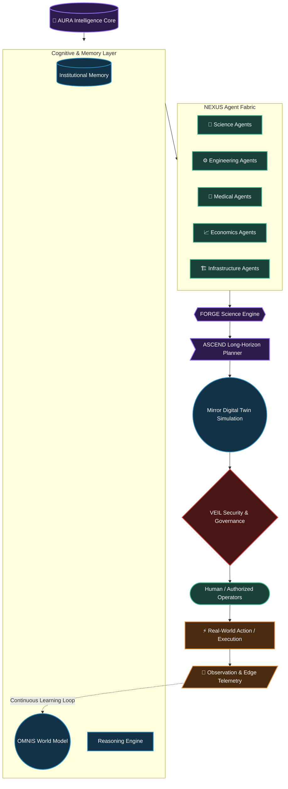

# ACI System Architecture

## Target Architecture

## Legacy to ACI Mapping
Existing ORION components map into the new architecture as follows:
- **TITAN CLOUD** -> OMNIS Backend / Data Lake
- **MIRROR TWIN** -> SIMULATION LAYER
- **PHOENIX EDGE** -> OBSERVATION / TELEMETRY Edge nodes
- **ATLAS GEO** -> OMNIS Spatial Engine
- **SENTIENCE** -> Legacy term, deprecated in favor of AURA
- **AEGIS COMMS** -> NEXUS Communication Bus
- **SHIELD IDENTITY** -> GOVERNANCE LAYER (Authentication)
- **FORGE CYBER** -> FORGE SCIENCE ENGINE (Generalized)
- **CHRONOS AUDIT** -> MEMORY / INSTITUTIONAL KNOWLEDGE
- **ASCEND** -> ASCEND PLANNER
