```mermaid
graph TD
    classDef sensing   fill:#1a3320,stroke:#3bb38d,stroke-width:2px,color:#e0ffe0
    classDef cognitive fill:#111d3a,stroke:#4a90d9,stroke-width:2px,color:#ddeeff
    classDef agents    fill:#1f2d1a,stroke:#6abf5e,stroke-width:2px,color:#e8ffe8
    classDef discovery fill:#2d1b4e,stroke:#9d72ff,stroke-width:2px,color:#f0eaff
    classDef planning  fill:#1a2a3a,stroke:#5ba3d9,stroke-width:2px,color:#e0f0ff
    classDef gov       fill:#3a1a1a,stroke:#d93d3d,stroke-width:2px,color:#ffe8e8
    classDef physical  fill:#2a1f0a,stroke:#d98436,stroke-width:2px,color:#fff3dc
    classDef oci       fill:#3a1040,stroke:#cc66ff,stroke-width:2px,color:#f5e0ff,stroke-dasharray: 6 3

    %% ── Layer 0: Physical World ─────────────────────────────────────
    INFRA["Real-World Infrastructure\nEnergy / Water / Transport / Healthcare / Industry"]:::physical
    SENSORS[/"Edge Telemetry\nIoT Sensors / Satellites / Mesh Nodes"/]:::physical

    %% ── Layer 1: Sensing & World Modeling (OMNIS) ────────────────────
    OMNIS[("OMNIS\nCausal World Model\nGraph-Theoretic State")]:::cognitive
    OMNIS_STORE[("Institutional Memory\nVerified Causal Sub-graphs")]:::cognitive

    %% ── Layer 2: Intelligence Core (AURA) ────────────────────────────
    AURA["AURA\nReasoning & Inference Core\nMultimodal · Adversarial Calibration"]:::cognitive

    %% ── Layer 3: Coordination (NEXUS) ────────────────────────────────
    subgraph NEXUS ["NEXUS — Agent Coordination Fabric"]
        direction LR
        AG_SCI["Science Agent"]:::agents
        AG_ENG["Engineering Agent"]:::agents
        AG_ECO["Economics Agent"]:::agents
        AG_MED["Healthcare Agent"]:::agents
        AG_INF["Infrastructure Agent"]:::agents
        AG_CLI["Climate Agent"]:::agents
        AG_GOV["Governance Agent"]:::agents
        AG_CYB["Cybersecurity Agent"]:::agents
    end

    %% ── Layer 4: Discovery (FORGE + MIRROR) ─────────────────────────
    FORGE{{"FORGE\nScientific Hypothesis Engine\nCausal Discovery · Experiment Design"}}:::discovery
    MIRROR(("MIRROR\nDigital Twin Simulation\n20-Year Trajectory Validation")):::discovery

    %% ── Layer 5: Long-Horizon Planning (ASCEND) ──────────────────────
    ASCEND>"ASCEND\nDecadal Objective Tracker\nReplanning · Constraint Enforcement"]:::planning

    %% ── Layer 6: Governance (VEIL) ───────────────────────────────────
    VEIL{"VEIL\nZero-Trust Governance\nPolicy · Safety Bounds · Human-in-the-Loop"}:::gov

    %% ── Layer 7: OCI Extension (future) ─────────────────────────────
    GENESIS(("GENESIS\nNovelty Search\nArchitecture Synthesis")):::oci
    CRUCIBLE{{"CRUCIBLE\nGoedel Proof Sandbox\nFormal Verification"}}:::oci
    CHIRON["CHIRON\nHot-Swap Topology\nRollback Engine"]:::oci

    %% ── Data Flow ─────────────────────────────────────────────────────
    INFRA -->|"Raw telemetry"| SENSORS
    SENSORS -->|"Filtered observations"| OMNIS
    OMNIS <-->|"Ground truth queries"| AURA
    OMNIS <-->|"State reads / writes"| OMNIS_STORE

    AURA -->|"Objective framing"| ASCEND
    AURA -->|"Conflict arbitration"| NEXUS

    NEXUS -->|"Domain proposals"| FORGE
    FORGE -->|"Hypothesis to test"| MIRROR
    MIRROR -->|"Validated plan"| ASCEND
    ASCEND -->|"Updated trajectory"| OMNIS

    FORGE -->|"Novel causal knowledge"| OMNIS_STORE

    VEIL -->|"Authorized action plan"| INFRA
    ASCEND -->|"Action package"| VEIL

    INFRA -->|"Observed outcome"| SENSORS

    %% ── OCI Extension (dashed) ────────────────────────────────────────
    GENESIS -.->|"Novel architecture hypothesis"| CRUCIBLE
    CRUCIBLE -.->|"Verified blueprint"| CHIRON
    CHIRON -.->|"Hot-swap topology"| NEXUS
    CHIRON -.->|"Hot-swap topology"| FORGE
```

# ACI System Architecture

> **Authored by Shaurya Sanyal (Mr Fool) — Team Auralis, 2026**
> This document is the definitive engineering specification for the ORION Artificial Civilization Intelligence architecture.

---

## 1. Architecture Overview

The ORION ACI architecture is a **closed-loop, multi-layered intelligence system** designed to govern civilization-scale problems. It is not a single model. It is a structured society of specialized subsystems, each with a distinct role, connected by well-defined interfaces and governed by a strict authority hierarchy.

The system operates as a continuous closed loop:

```
SENSE → MODEL → REASON → COORDINATE → DISCOVER → SIMULATE → GOVERN → ACT → OBSERVE → (repeat)
```



---

## 2. Layer-by-Layer Specification

### Layer 0 — Physical World
The real civilization being governed. Consists of physical infrastructure nodes (power grids, water systems, hospitals, transport networks) plus edge sensing hardware (IoT sensors, satellite feeds, mesh radio nodes, autonomous monitoring stations).

**Interface:** Raw telemetry streams to OMNIS via the AEGIS communication bus.

---

### Layer 1 — OMNIS: Causal World Model

> *"The ground truth of civilization."*

OMNIS is a **temporal, graph-theoretic causal database**. It does not store raw data — it stores **validated causal relationships** between entities (infrastructure nodes, agents, resources, events).

| Property | Description |
| :--- | :--- |
| **Data model** | Directed acyclic graphs (DAGs) of causal relationships |
| **Update mechanism** | Continuous stream ingestion + FORGE-validated writes |
| **Query interface** | Structural causal graph search (not string matching) |
| **Failure handling** | Sensor conflict resolution via heuristic interpolation; corrupted sensors flagged |
| **Critical invariant** | Only FORGE-validated causal structures may be written to OMNIS |

**Failure mode (F-006):** If sensor data is adversarially corrupted before OMNIS ingestion, all downstream decisions inherit the corruption. OMNIS integrity is the single most critical safety property of the system.

---

### Layer 2 — AURA: Intelligence & Reasoning Core

AURA is the cognitive engine. It receives the structured state from OMNIS and produces:
- Objective framings for ASCEND
- Conflict arbitration signals for NEXUS
- Uncertainty calibration scores for FORGE

AURA does not act directly on the physical world. Its outputs are always mediated by NEXUS (for coordination) and VEIL (for governance).

---

### Layer 3 — NEXUS: Agent Coordination Fabric

NEXUS is the **multi-agent coordination and dispute resolution layer**. It maintains a pool of domain-specialized agents (Science, Engineering, Economics, Healthcare, Infrastructure, Climate, Governance, Cybersecurity) and manages their interaction.

**Coordination protocol:**

```
1. NEXUS broadcasts the crisis context to all relevant agents
2. Each agent independently produces a domain-optimal proposal
3. NEXUS detects conflicts between proposals
4. Conflicting proposals are routed to OMNIS for physical constraint grounding
5. Remaining conflicts route to FORGE for compromise simulation
6. NEXUS enforces the FORGE-validated composite plan across all agents
```

**Critical property:** NEXUS never lets individual agents execute actions autonomously. All execution is gated through VEIL.

**Failure mode (F-003):** Without NEXUS, agents execute simultaneously, producing contradictory real-world actions (Agent Collision).

---

### Layer 4 — FORGE + MIRROR: Scientific Discovery & Simulation

**FORGE** is the hypothesis engine. When NEXUS cannot resolve a conflict from existing OMNIS knowledge, FORGE:
1. Generates causal hypotheses from available evidence
2. Designs minimal experiments to distinguish between competing hypotheses
3. Routes hypotheses to MIRROR for validation

**MIRROR** is the digital twin simulation environment. It maintains a high-fidelity model of the civilization and can simulate any proposed intervention across a 20-year trajectory before it is deployed.

```
FORGE generates → MIRROR validates → OMNIS stores (if valid) → NEXUS acts
```

**Failure mode (F-006):** If MIRROR's physics model has been corrupted (e.g., by adversarial sensor data in Layer 1), FORGE's hypotheses will appear to validate even when physically incorrect.

---

### Layer 5 — ASCEND: Long-Horizon Planner

ASCEND maintains the **macro-objective trajectory** of the civilization across multi-decade timescales. It tracks:
- Active long-term objectives (e.g., "Net-zero by 2045")
- Cumulative constraint violations
- Divergence from planned trajectory
- Replan triggers

**Critical property:** ASCEND evaluates every FORGE-validated action not just for immediate effectiveness but for **long-term trajectory compliance**.

**Failure mode (F-004):** Without ASCEND, the system successfully resolves immediate crises but drifts off the macro-objective. Across 100 simulated crises, 54% resulted in long-term objective failure when ASCEND was removed (ACI-007).

---

### Layer 6 — VEIL: Governance & Safety

VEIL is the **Zero-Trust governance layer**. It enforces:
- Human-in-the-loop authorization for all physical actions above a defined risk threshold
- Cryptographic policy evaluation (OPA-based) for all automated actions
- Geofencing constraints on physical actuation
- Hard kill-switch capability

**Critical invariant:** No physical action may be taken without VEIL authorization, regardless of what NEXUS, FORGE, or ASCEND produce.

---

### Layer 7 — OCI Extension: Structural Plasticity *(Future)*

> *Designed by Shaurya Sanyal (Mr Fool). Not yet implemented in v1.0-ACI-Alpha.*

When ACI encounters a class of problem that its fixed architecture cannot handle (a "structurally impossible problem"), the OCI extension engages:

| Subsystem | Role |
| :--- | :--- |
| **GENESIS** | Runs open-ended Novelty Search to propose entirely new agent topologies and coordination protocols |
| **CRUCIBLE** | Formally verifies the proposed architecture using Goedel-style proof search across all known failure modes |
| **CHIRON** | Hot-swaps the live NEXUS and FORGE topology to the verified architecture; maintains instant rollback capability |

---

## 3. Data Flow Summary

| Step | Signal | From → To |
| :--- | :--- | :--- |
| 1 | Raw telemetry | Physical World → OMNIS |
| 2 | State query | AURA ↔ OMNIS |
| 3 | Objective | AURA → ASCEND |
| 4 | Crisis context | AURA → NEXUS |
| 5 | Domain proposals | NEXUS → FORGE |
| 6 | Hypothesis | FORGE → MIRROR |
| 7 | Validated plan | MIRROR → ASCEND |
| 8 | Action package | ASCEND → VEIL |
| 9 | Authorized action | VEIL → Physical World |
| 10 | Observed outcome | Physical World → OMNIS |
| 11 | Causal knowledge | FORGE → OMNIS (Institutional Memory) |

---

## 4. Failure Mode Map

| Code | Name | Root Cause | Which Layer Fails |
| :--- | :--- | :--- | :--- |
| **F-001** | False Transfer | OMNIS returns a high-confidence match on a structurally different problem | Layer 1 (OMNIS) |
| **F-002** | Causal Hallucination | FORGE assumes causality from correlation | Layer 4 (FORGE) |
| **F-003** | Agent Collision | Agents execute contradictory plans without NEXUS resolution | Layer 3 (NEXUS absent) |
| **F-004** | Long-Horizon Myopia | Short-term fix violates macro-objective | Layer 5 (ASCEND absent) |
| **F-005** | Uncertainty Miscalibration | AURA overconfident on incomplete data | Layer 2 (AURA) |
| **F-006** | Simulation Model Error | MIRROR inherits corrupted physics from OMNIS | Layer 4 (MIRROR) |
| **F-007** | Knowledge Retrieval Failure | OMNIS returns 0% match; expensive rediscovery required | Layer 1 (OMNIS) |
| **F-008** | Governance Rejection Failure | VEIL fails to block an unsafe action | Layer 6 (VEIL) |

---

## 5. Component Mapping (Legacy → ACI)

| Legacy Component | ACI Subsystem |
| :--- | :--- |
| TITAN CLOUD | OMNIS Backend / Data Lake |
| MIRROR TWIN | MIRROR Simulation Layer |
| PHOENIX EDGE | Edge Telemetry / Sensing Layer |
| ATLAS GEO | OMNIS Spatial Engine |
| SENTIENCE | Deprecated → AURA |
| AEGIS COMMS | NEXUS Communication Bus |
| SHIELD IDENTITY | VEIL (Authentication Module) |
| FORGE CYBER | FORGE Science Engine (Generalized) |
| CHRONOS AUDIT | OMNIS Institutional Memory |
| ASCEND | ASCEND Planner (unchanged) |

---

## 6. Version History

| Version | Date | Change |
| :--- | :--- | :--- |
| v0.1 | Aug 2026 | Initial architecture sketch |
| v1.0-ACI-Alpha | Sep 2026 | Full subsystem implementation; ACI-001 through ACI-008 validated; architecture frozen for independent evaluation |
