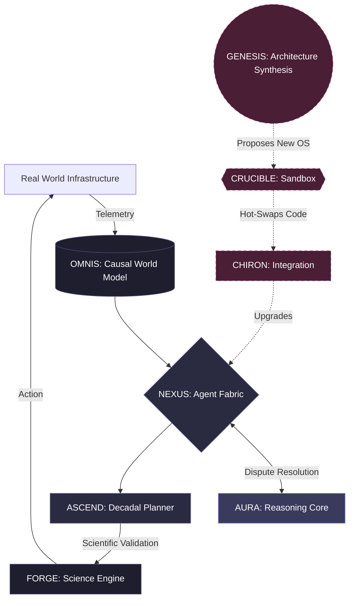

---
hide:
  - toc
---

<div class="hero" markdown>
<div class="hero-content" markdown>

# Artificial Civilization Intelligence

**A distributed, antifragile, institutional intelligence for planetary-scale governance**

ACI is not a smarter chatbot. It is a new class of intelligence — one that operates across civilizational timescales, integrates physical infrastructure with scientific reasoning, and self-improves through empirically validated architectural cycles.

[Explore the Architecture](architecture/ACI_SYSTEM_ARCHITECTURE.md){ .md-button .md-button--primary }
[Read the Benchmark](research/ACI_001_BENCHMARK.md){ .md-button }

</div>
</div>

---

## Key Results

<div class="grid cards" markdown>

-   **8 Experiments**

    ---

    ACI-001 through ACI-008 completed under the v1.0-ACI-Alpha benchmark framework.

-   **90 / 100 ACI Score**

    ---

    Achieved on integrated benchmark ACI-008 under the ORION-defined evaluation protocol.

-   **22.9% AEA**

    ---

    Accumulated Empirical Advantage on unseen causal structures — verified across Phase A and Phase C blind tests.

-   **100% Threshold Rate**

    ---

    Over 1,000 Phase B replication runs, every run exceeded the 70/100 pass threshold (Mean 90.45, SD 2.19).

</div>

---

## What is ACI?

Artificial Civilization Intelligence (ACI) is a post-AGI architectural paradigm proposed by Raja Dharma Tej Maddala under Team Auralis. Where Artificial General Intelligence (AGI) targets human-level reasoning and Artificial Super Intelligence (ASI) targets maximal cognitive performance in an individual system, **ACI targets civilizational-scale institutional function**: the capacity to run, maintain, and improve entire societies under adversarial, resource-constrained, and catastrophically uncertain conditions.

An ACI system is not judged by IQ or benchmark scores alone. It is judged by whether it can:

- Maintain causal world models of real infrastructure under sensor noise and deception
- Coordinate thousands of heterogeneous sub-agents without central bottlenecks
- Run multi-decade scientific programs and validate their own hypotheses
- Detect and survive adversarial manipulation, including attacks on its own architecture
- Recursively redesign its own components within sandboxed environments

The ACI-001 Benchmark operationalises these demands as a 10-dimensional scoring matrix (max 100 points), covering Causal Persistence, Cross-Domain Transfer, Adversarial Robustness, Recursive Self-Improvement, and more.

---

## Architecture



**Solid arrows** indicate live production data flows. **Dashed arrows** indicate the recursive self-improvement loop — GENESIS proposes architectural changes, CRUCIBLE sandboxes them, and CHIRON hot-swaps validated upgrades into the running system without downtime.

---

## Experiment Progression

The ACI-001 benchmark was developed iteratively through 8 experiments across four phases:

```
ACI-001 Persistence
        |
        v
ACI-002 Transfer
        |
        v
ACI-003 Causal Generalization
        |
        v
ACI-004 Causal Discovery
        |
        v
   Replication Suite (Phase B — 1,000 runs)
        |
        v
ACI-005 Open-World Robustness
        |
        v
ACI-006 Multi-Agent Coordination
        |
        v
ACI-007 Ablation Study
        |
        v
ACI-008 Integrated Benchmark  -->  Score: 90 / 100
        |
        v
   Freeze: v1.0-ACI-Alpha
```

Each experiment added new scoring dimensions and identified failure modes now catalogued in the **Failure Corpus** (F-001 through F-008).

---

## Quick Links

| Resource | Description |
|---|---|
| [ACI-001 Benchmark](research/ACI_001_BENCHMARK.md) | Full 10-dimensional scoring protocol and all experimental results |
| [System Architecture](architecture/ACI_SYSTEM_ARCHITECTURE.md) | Technical specification of all six primary subsystems |
| [OMNIS World Model](architecture/OMNIS_WORLD_MODEL.md) | Causal world model design and implementation |
| [AURA Reasoning Core](architecture/AURA_INTELLIGENCE_ARCHITECTURE.md) | Dispute resolution and meta-reasoning layer |
| [Empirical Methodology](ACI_EMPIRICAL_METHODOLOGY.md) | How experiments are designed, blinded, and replicated |
| [Beyond ASI](BEYOND_ASI_THE_ACI_PARADIGM.md) | Why ACI is a distinct paradigm, not a superset of ASI |
| [ACI vs AGI vs ASI](ACI_VS_AGI_VS_ASI.md) | Formal comparison table across all three paradigms |
| [Roadmap](roadmap/ACI_ROADMAP.md) | v2.0 development milestones and open research questions |
